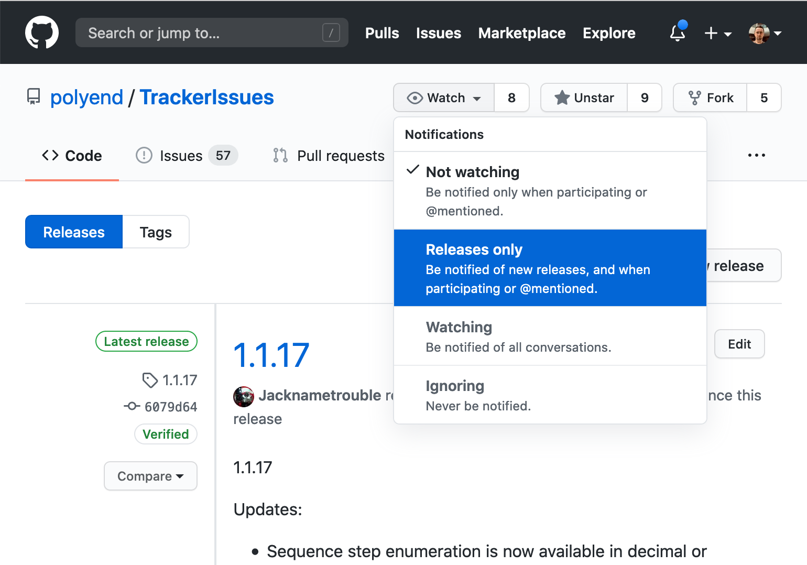

# Testing Pre-release Builds of the Preset firmware

## Before you begin

Hi there! Are you interested in testing beta versions of the next
Preset firmware?  Great, we're glad to hear that.  Let's just set
some expectations up-front: **beta releases are provided on an "as is"
basis**.  That means any of the following:

* they may introduce new bugs that may lead to loss of work or crashes
  during performance;

* they may introduce new features that will probably not be documented
  before the next stable release;

* they may change or remove previously existing features, both
  documented and undocumented; and

* they may change the data format of the projects or instruments you
  save, making it impossible to open them with an older firmware
  version.

If you find those risks acceptable, let's get you started!

## Download a .hex file

You can find the latest `.hex`` files in the
[Releases](https://github.com/polyend/PresetIssues/releases/) section
of this repository.  Note that the "Source Code" in each release doesn't
actually contain Preset's sources but just this repository's files,
including the one you're reading now.

## Download the Polyend Tool

You can find it on our [Downloads](https://polyend.com/downloads/) page.
Please unpack it in a convenient location and follow the instructions in the included `!instructions.txt` file.

## How to get notified about new releases?

If you sign up for GitHub and subscribe to our PresetIssues repository,
you'll get notified about new releases:

## If you find bugs

That's why we're testing! Report them
[here](https://github.com/polyend/PresetIssues).

## In case of trouble

But if your device lost power during the upgrade or the firmware doesn't boot up for any other reason and it is not detected by the Polyend Tool you can perform the emergency flashing procedures as follows:

* just simply press the hidden reset button on the inside of the
module (in the middle of the area below the pads section) and it will turn the device into recovery mode. Use the Polyend Tool to flash it again.

